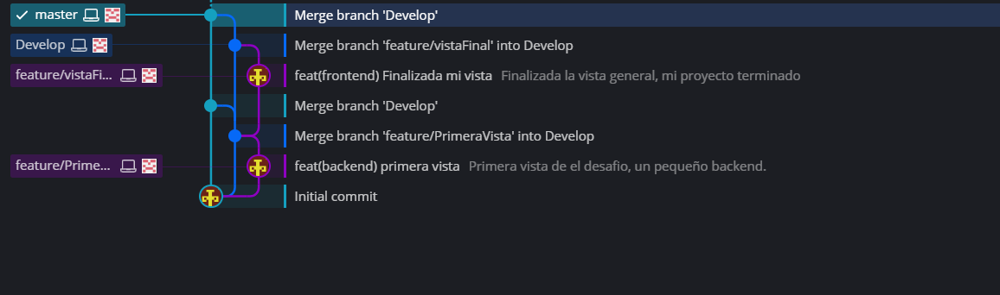

# Descripción del Proyecto

Este proyecto es una aplicación web que permite encriptar y desencriptar mensajes utilizando un sistema de reemplazo de caracteres específico. El objetivo es crear una forma sencilla de codificar y decodificar textos a través de un sencillo interfaz de usuario.

# Estructura del Código

El proyecto está compuesto por tres principales archivos:

- **HTML:** Define la estructura de la página web.
- **CSS:** Define el estilo visual de los elementos en la página.
- **JavaScript:** Proporciona la lógica para encriptar, desencriptar, y copiar textos.

## Estructura HTML

El archivo HTML define la estructura básica de la página. A continuación, se destacan algunos elementos clave:

- **Cabecera (header):** Contiene un logotipo y los botones de navegación.
- **Área de Texto (textarea):** Aquí es donde el usuario ingresa el texto que desea encriptar o desencriptar.
- **Controles de Acción:** Radio buttons permiten al usuario seleccionar si desea encriptar o desencriptar el texto.
- **Pie de Página (footer):** Incluye enlaces a redes sociales y un enlace al repositorio del proyecto.

## Estilo CSS

El archivo CSS define el estilo y la presentación de los elementos en la página:

- **Cuerpo (body):** Utiliza una fuente sans-serif, un margen de 20px y una disposición en columna para alinear los elementos verticalmente.
- **Área de Texto (textarea):** Se asegura de que ocupe el 100% del ancho disponible, con un relleno y un margen para mejorar la usabilidad.
- **Botones (button):** Están estilizados con un color de fondo verde, texto blanco, y un efecto de hover que cambia ligeramente el color de fondo.
- **Pie de Página (footer):** Se fija en la parte inferior de la página y se alinea al centro, con un fondo oscuro y texto blanco.

## Lógica JavaScript

El archivo JavaScript contiene las funciones necesarias para encriptar, desencriptar, procesar el texto ingresado, y copiar el resultado al portapapeles.

- **Funciones de Encriptación/Desencriptación:**
  - **encrypt(text):** Reemplaza ciertas vocales por cadenas específicas (e.g., "e" por "enter").
  - **decrypt(text):** Revierte el proceso de encriptación.
- **Procesar Texto:**
  - **processText():** Lee el texto del área de texto y decide si encriptar o desencriptar según la opción seleccionada, mostrando el resultado en la página.
- **Copiar al Portapapeles:**
  - **copyToClipboard():** Copia el texto encriptado o desencriptado al portapapeles del usuario.

# Flujo de Trabjo en Git

Este proyecto sigue un flujo de trabajo de Git basado en ramas que se dividen en diferentes etapas de desarrollo. A continuación se describe cada una de las ramas y sus propósitos:

1. **master:** 
   - Es la rama principal del proyecto y contiene el código que se considera estable.
   - Se realizan merges en esta rama una vez que las funcionalidades han sido completamente desarrolladas y probadas.
2. **Develop:**
    - Esta es la rama de desarrollo principal.
    - Aquí se integran todas las nuevas funcionalidades antes de ser fusionadas en master.
    - Sirve como una versión preliminar donde el código es probado y validado antes de pasar a producción.
3. **feature/vistaFinal:**
    - Rama creada para desarrollar y finalizar la vista del proyecto.
    - El commit con el mensaje feat(frontend) Finalizada mi vista indica que el desarrollo de la vista ha sido completado.
    - Una vez completada, esta rama se fusionó en Develop para integrarse con el resto del código.
4. **feature/PrimeraVista:**
   -    Rama utilizada para implementar una primera vista del backend del proyecto.
   -    El commit con el mensaje feat(backend) primera vista señala la implementación inicial de la funcionalidad de backend.
   -    Después de finalizar esta primera implementación, la rama se fusionó en Develop.

## Resumen del Flujo:
- El trabajo se inicia en ramas **feature** para el desarrollo de nuevas funcionalidades.
- Estas ramas se fusionan en **Develop** una vez que la funcionalidad es implementada y probada.
- Finalmente, **Develop** se fusiona en **master** para asegurar que solo el código estable llegue a la versión de producción.

Este flujo de trabajo asegura que el código se desarrolle de manera organizada, con un proceso claro para integrar y probar nuevas funcionalidades antes de su lanzamiento final.

# Recursos Adicionales
- **Bootstrap:** La página utiliza Bootstrap 5.0.2 para un diseño responsivo y estilizado.
- **Font Awesome:** Se utiliza para agregar iconos sociales, como el icono de GitHub.

# Enlaces Importantes

- **Repositorio del Proyecto:** [Link Repositorio](https://github.com/Sosaaaa700/DESAFIO_G7_JULIOSOLORZANO.git)